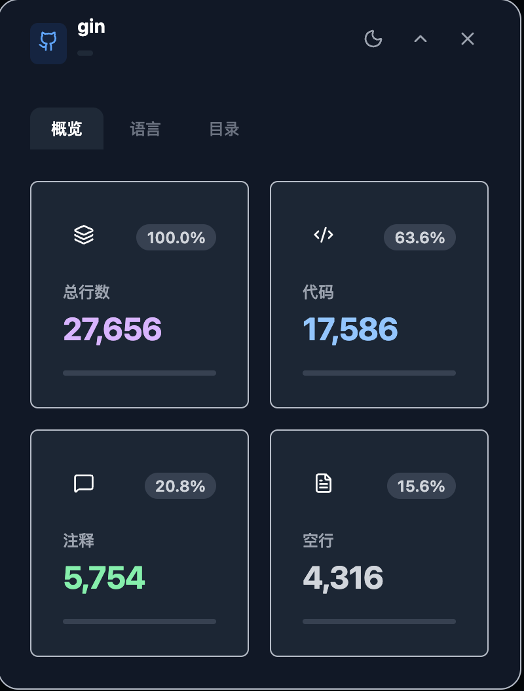
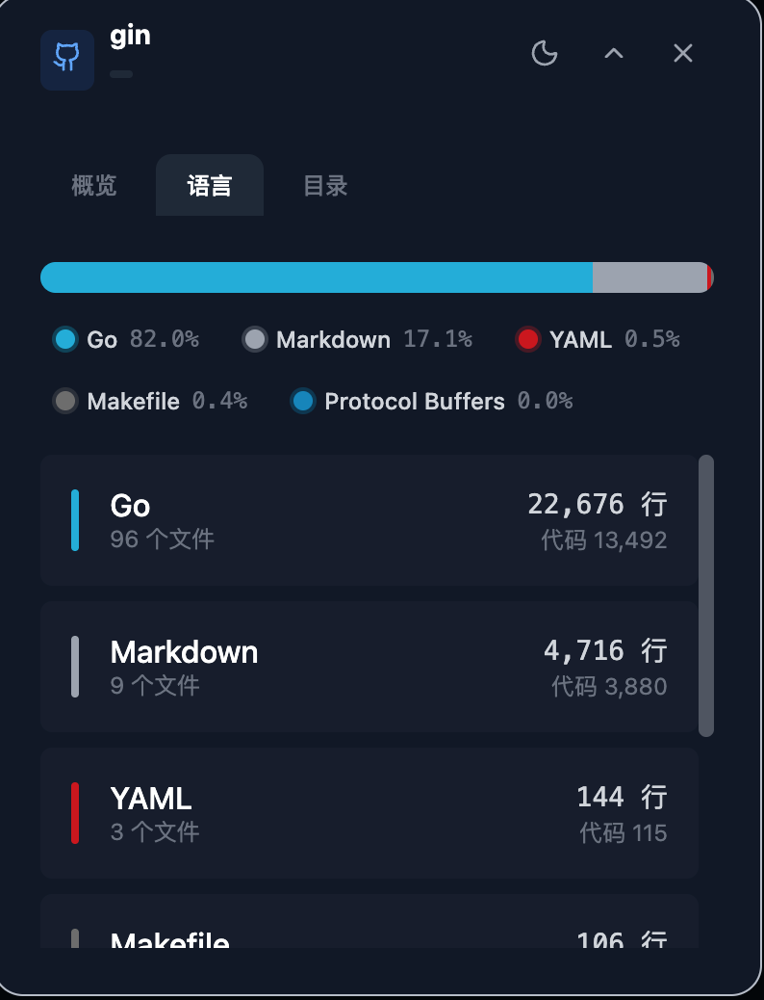
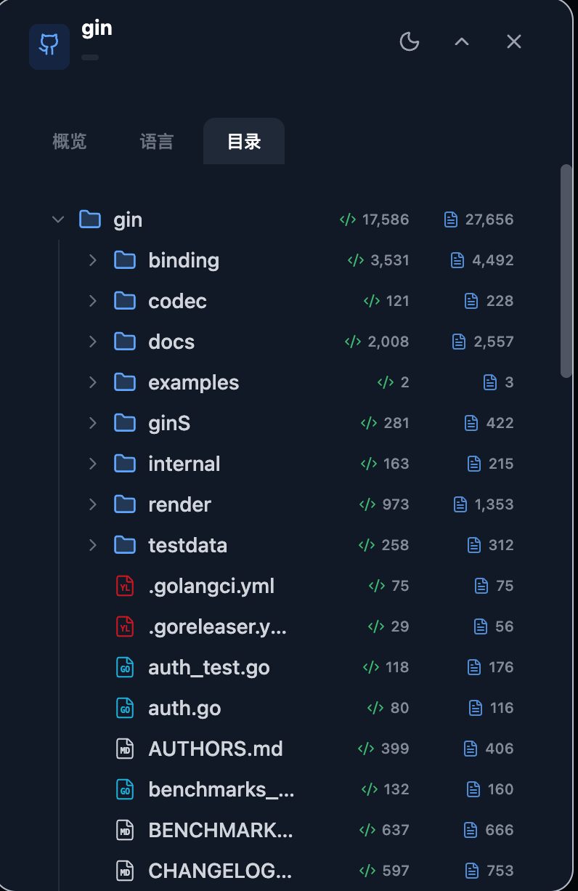

<div align="center">


# GoLoc

**GitHub 仓库代码统计分析工具**

*A powerful GitHub repository code statistics analyzer*

[](https://golang.org/)
[](https://www.typescriptlang.org/)
[](LICENSE)
[](https://chrome.google.com/webstore)

[English](#english) | [中文](#中文)

</div>

---

## 中文

### 📖 简介

GoLoc 是一个强大的 GitHub 仓库代码统计分析工具，由 **后端服务** 和 **Chrome 浏览器扩展** 两部分组成。它能够快速分析任意 GitHub 仓库的代码统计信息，包括代码行数、注释行数、空行数等，并以美观的可视化界面展示。

### ✨ 功能特性

- 🚀 **快速分析** - 使用 Go 语言构建的高性能后端，秒级完成仓库分析
- 📊 **多维统计** - 代码行数、注释行数、空行数、总行数等多维度统计
- 🌳 **目录树视图** - 直观展示仓库文件结构及各目录/文件的代码统计
- 🎨 **语言识别** - 自动识别 150+ 编程语言，配有对应语言图标和颜色
- 🌓 **主题切换** - 统计面板支持浅色/深色/跟随系统主题
- 💾 **智能缓存** - 内置缓存机制，避免重复分析，响应更快
- ⚙️ **可配置** - 支持调整缓存时间、分析超时、最大仓库大小等参数

### 🖼️ 截图预览








### 🛠️ 技术栈

**后端 (Server)**
- Go 1.25+
- 标准库 `net/http`
- [gocloc](https://github.com/hhatto/gocloc) - 代码行数统计
- Docker 支持

**前端 (Chrome Extension)**
- React 18 + TypeScript
- Vite + @crxjs/vite-plugin
- Tailwind CSS
- Lucide Icons

---

### 🚀 快速开始

#### 方式一：使用 Docker（推荐）

**使用 Docker Run**

```bash
docker run -d \
  --name goloc \
  -p 8080:8080 \
  -e GITHUB_TOKEN=your_github_token \
  -e CACHE_TTL=604800 \
  -e MAX_REPO_SIZE_MB=100 \
  ghcr.io/coderzoe/goloc:latest
```

**使用 Docker Compose**

创建 `docker-compose.yml` 文件：

```yaml
version: '3.8'

services:
  goloc:
    image: ghcr.io/coderzoe/goloc:latest
    container_name: goloc
    restart: unless-stopped
    ports:
      - "8080:8080"
    environment:
      # GitHub Token（可选，用于提高 API 限制）
      - GITHUB_TOKEN=${GITHUB_TOKEN:-}
      # 缓存有效期（秒），默认 7 天
      - CACHE_TTL=604800
      # 最大仓库大小限制（MB）
      - MAX_REPO_SIZE_MB=100
```

启动服务：

```bash
docker-compose up -d
```

#### 方式二：手动构建

**构建后端**

```bash
# 进入后端目录
cd server

# 安装依赖
go mod download

# 运行开发服务器
go run .

# 或者构建二进制文件
go build -o goloc .
./goloc
```

**构建前端扩展**

```bash
# 进入扩展目录
cd extension

# 安装依赖
npm install

# 开发模式
npm run dev

# 构建生产版本
npm run build
```

构建完成后，`extension/dist` 目录即为可加载的 Chrome 扩展。

---

### 📦 安装 Chrome 扩展

1. 打开 Chrome 浏览器，访问 `chrome://extensions/`
2. 开启右上角的「开发者模式」
3. 点击「加载已解压的扩展程序」
4. 选择 `extension/dist` 目录
5. 扩展安装完成！

### ⚙️ 配置说明

#### 环境变量

| 变量名 | 说明 | 默认值 |
|--------|------|--------|
| `GITHUB_TOKEN` | GitHub Personal Access Token（可选，用于私有仓库和提高 API 限制） | - |
| `CACHE_TTL` | 缓存有效期（秒） | `604800` (7天) |
| `MAX_REPO_SIZE_MB` | 最大仓库大小限制（MB） | `100` |
| `HTTP_PROXY` / `http_proxy` | HTTP 代理地址（可选，用于访问 GitHub） | - |
| `HTTPS_PROXY` / `https_proxy` | HTTPS 代理地址（可选，用于访问 GitHub） | - |
| `NO_PROXY` / `no_proxy` | 不走代理的地址列表 | `localhost,127.0.0.1` |

#### 扩展设置

点击扩展图标打开设置面板：

- **服务器地址** - 后端服务地址，如 `http://localhost:8080`
- **自动分析** - 进入 GitHub 仓库页面时自动开始分析
- **缓存有效期** - 分析结果缓存时间
- **请求超时** - 分析请求超时时间
- **最大仓库大小** - 限制可分析的仓库大小
- **默认深度** - 目录树展示深度

---

### 📥 下载

| 类型 | 下载链接 |
|------|----------|
| Chrome 扩展 | [Releases](https://github.com/coderzoe/goloc/releases) |
| 后端二进制 (Linux) | [Releases](https://github.com/coderzoe/goloc/releases) |
| 后端二进制 (macOS) | [Releases](https://github.com/coderzoe/goloc/releases) |
| 后端二进制 (Windows) | [Releases](https://github.com/coderzoe/goloc/releases) |
| Docker 镜像 | `ghcr.io/coderzoe/goloc:latest` |

---

## English

### 📖 Introduction

GoLoc is a powerful GitHub repository code statistics analyzer, consisting of a **backend service** and a **Chrome browser extension**. It quickly analyzes code statistics for any GitHub repository, including lines of code, comments, blanks, and more, presenting them in a beautiful visualized interface.

### ✨ Features

- 🚀 **Fast Analysis** - High-performance backend built with Go, completes analysis in seconds
- 📊 **Multi-dimensional Statistics** - Lines of code, comments, blanks, total lines, and more
- 🌳 **Directory Tree View** - Intuitive display of repository structure with per-file/folder statistics
- 🎨 **Language Recognition** - Auto-detects 150+ programming languages with corresponding icons and colors
- 🌓 **Theme Switching** - Stats panel supports light/dark/system themes
- 💾 **Smart Caching** - Built-in caching mechanism for faster repeated access
- ⚙️ **Configurable** - Adjustable cache duration, timeout, max repo size, and more

### 🖼️ Screenshots


### 🛠️ Tech Stack

**Backend (Server)**
- Go 1.21+
- Standard library `net/http`
- [gocloc](https://github.com/hhatto/gocloc) - Code line counter
- Docker support

**Frontend (Chrome Extension)**
- React 18 + TypeScript
- Vite + @crxjs/vite-plugin
- Tailwind CSS
- Lucide Icons

---

### 🚀 Quick Start

#### Option 1: Using Docker (Recommended)

**Using Docker Run**

```bash
docker run -d \
  --name goloc \
  -p 8080:8080 \
  -e GITHUB_TOKEN=your_github_token \
  -e CACHE_TTL=604800 \
  -e MAX_REPO_SIZE_MB=100 \
  ghcr.io/coderzoe/goloc:latest
```

**Using Docker Compose**

Create a `docker-compose.yml` file:

```yaml
version: '3.8'

services:
  goloc:
    image: ghcr.io/coderzoe/goloc:latest
    container_name: goloc
    restart: unless-stopped
    ports:
      - "8080:8080"
    environment:
      # GitHub Token (optional, for higher API rate limits)
      - GITHUB_TOKEN=${GITHUB_TOKEN:-}
      # Cache TTL in seconds, default 7 days
      - CACHE_TTL=604800
      # Max repository size limit in MB
      - MAX_REPO_SIZE_MB=100
```

Start the service:

```bash
docker-compose up -d
```

#### Option 2: Build from Source

**Build Backend**

```bash
# Enter server directory
cd server

# Download dependencies
go mod download

# Run development server
go run .

# Or build binary
go build -o goloc .
./goloc
```

**Build Chrome Extension**

```bash
# Enter extension directory
cd extension

# Install dependencies
npm install

# Development mode
npm run dev

# Build for production
npm run build
```

After building, the `extension/dist` directory is the loadable Chrome extension.

---

### 📦 Install Chrome Extension

1. Open Chrome browser and navigate to `chrome://extensions/`
2. Enable "Developer mode" in the top right corner
3. Click "Load unpacked"
4. Select the `extension/dist` directory
5. Extension installed!

### ⚙️ Configuration

#### Environment Variables

| Variable | Description | Default |
|----------|-------------|---------|
| `GITHUB_TOKEN` | GitHub Personal Access Token (optional, for private repos and higher rate limits) | - |
| `CACHE_TTL` | Cache duration in seconds | `604800` (7 days) |
| `MAX_REPO_SIZE_MB` | Maximum repository size limit in MB | `100` |
| `HTTP_PROXY` / `http_proxy` | HTTP proxy URL (optional, for accessing GitHub) | - |
| `HTTPS_PROXY` / `https_proxy` | HTTPS proxy URL (optional, for accessing GitHub) | - |
| `NO_PROXY` / `no_proxy` | Addresses to bypass proxy | `localhost,127.0.0.1` |

#### Extension Settings

Click the extension icon to open settings:

- **Server Address** - Backend service URL, e.g., `http://localhost:8080`
- **Auto Analyze** - Automatically start analysis when entering a GitHub repo page
- **Cache Duration** - How long analysis results are cached
- **Request Timeout** - Analysis request timeout
- **Max Repo Size** - Limit the size of repositories that can be analyzed
- **Default Depth** - Directory tree display depth

---

### 📥 Downloads

| Type | Download Link |
|------|---------------|
| Chrome Extension | [Releases](https://github.com/coderzoe/goloc/releases) |
| Backend Binary (Linux) | [Releases](https://github.com/coderzoe/goloc/releases) |
| Backend Binary (macOS) | [Releases](https://github.com/coderzoe/goloc/releases) |
| Backend Binary (Windows) | [Releases](https://github.com/coderzoe/goloc/releases) |
| Docker Image | `ghcr.io/coderzoe/goloc:latest` |

---

### 🤝 Contributing

Contributions are welcome! Please feel free to submit a Pull Request.

### 📄 License

This project is licensed under the MIT License - see the [LICENSE](LICENSE) file for details.

